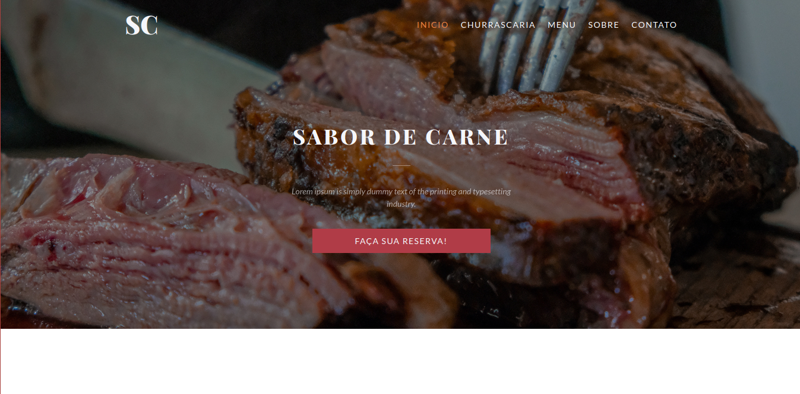
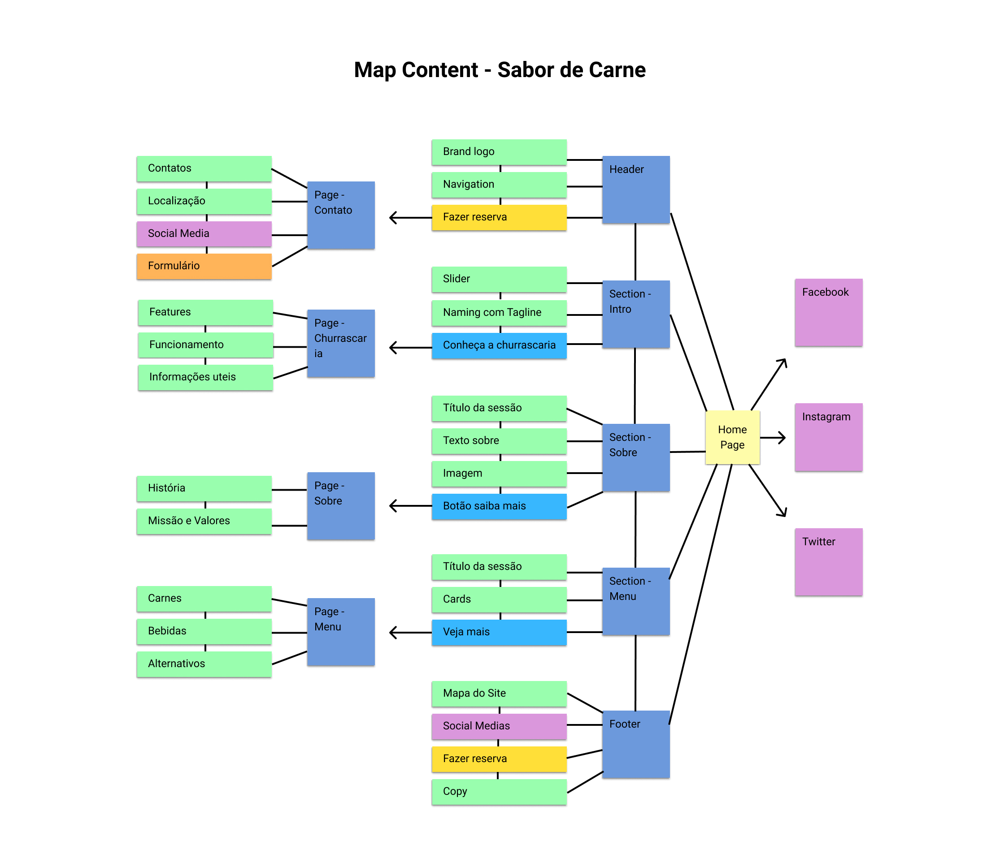
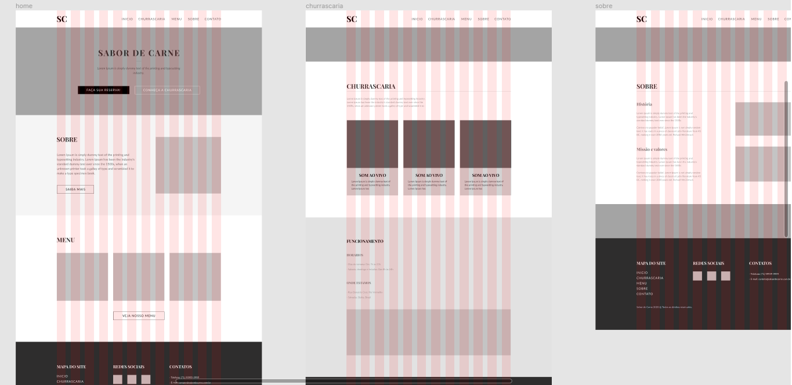
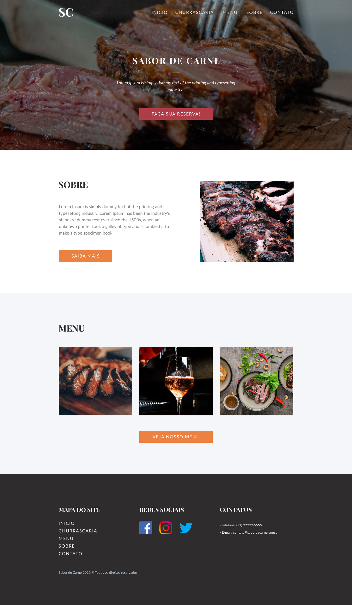
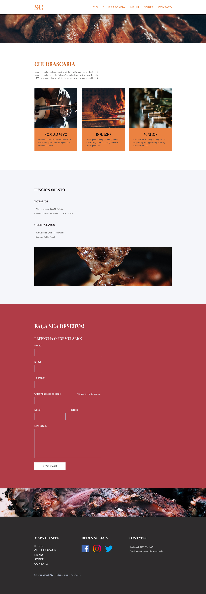
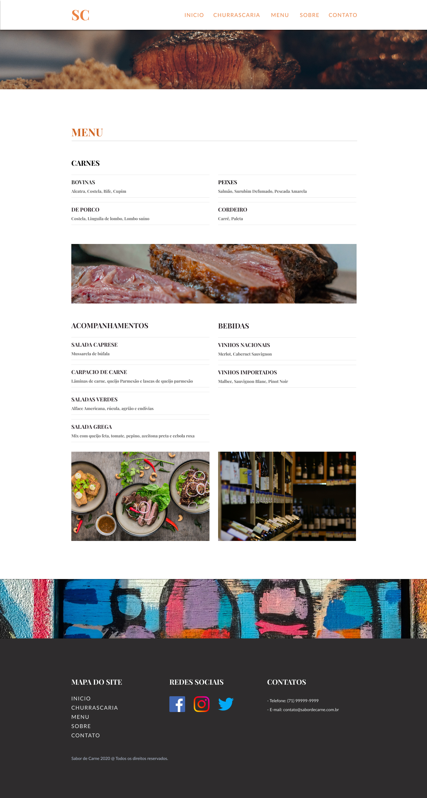
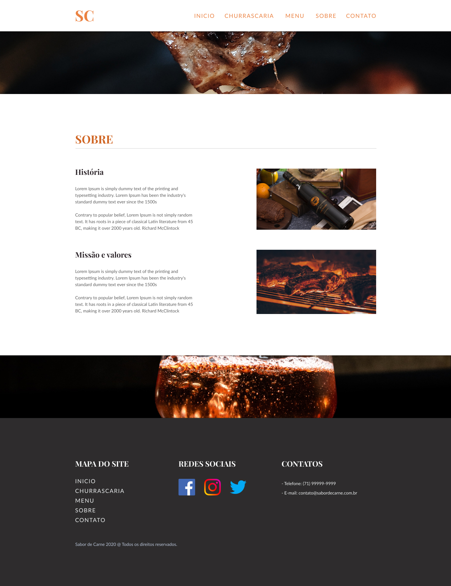
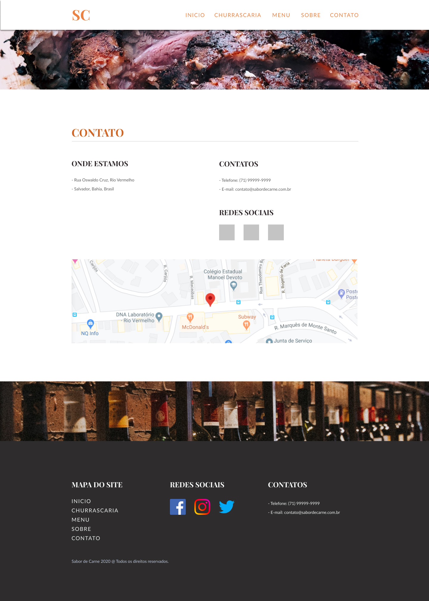

<h1 style="font-size: 48px; line-height: 58px;">Sabor de Carne</h1>

<h2 style="font-size: 36px; line-height: 46px;">About</h2>

<h3 style="font-size: 24px; line-height: 34px;">Goal</h3>

    O site institucional Sabor de Carne tem o objetivo de divulgar os serviços que a Churrascaria tem a oferecer, bem como informar sobre ela, valores, contato, e o menu.

<h3 style="font-size: 24px; line-height: 34px;">Project</h3>

    O projeto consistiu na criação de uma landing page, com pré etapas de plajenamento, branding, pré-design (Wireframe), ui e prototipação (Moodboard, Definição de Linguagem Visual, Layout e Prototipo) e por fim desenvolvimento (HTML,CSS,JS,Design Responsivo,Otimização,Validação W3C,SEO e Acessibilidade).

<h3 style="font-size: 24px; line-height: 34px;">Technologies</h3>
<ul>
    <li><a href="https://developer.mozilla.org/pt-BR/docs/Web/HTML">HTML</a></li>
    <li><a href="https://developer.mozilla.org/pt-BR/docs/Web/CSS">CSS</a></li>
    <li><a href="https://developer.mozilla.org/pt-BR/docs/Web/JavaScript">JavaScript</a></li>
    <li><a href="https://gulpjs.com">Gulp</a></li>
    <li><a href="https://getbootstrap.com">Bootstrap</a></li>
    <li><a href="https://www.npmjs.com">NPM</a></li>
    <li><a href="https://jquery.com">Jquery</a></li>
    <li><a href="https://git-scm.com">Git</a></li>
</ul>

<h3 style="font-size: 24px; line-height: 34px;">Skills</h3>
<ul>
    <li>Naming</li>
    <li>Branding</li>
    <li>Wireframe</li>
    <li>Moodboard</li>
    <li>UI</li>
    <li>Prototype</li>
    <li>Responsive Design</li>
    <li>SEO</li>
    <li>GH-Pages</li>
    <li>Front End</li>
</ul>

<h3 style="font-size: 24px; line-height: 34px;">Tools</h3>
<ul>
    <li>Figma</li>
    <li>Notion</li>
    <li>Trello</li>
</ul>

<h3 style="font-size: 24px; line-height: 34px;">Authors</h3>
<ul>
    <li><a href="https://www.linkedin.com/in/matheusdoe-dev/">Matheus do É Santos</a>: Front End Developer | Web Designer</li>
</ul>

<h3>Screenshots</h3>

 

 

 

 

 

 

 

 
