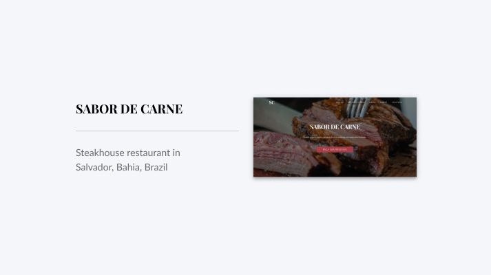

# Sabor de Carne

> Steakhouse

[![NPM Version][npm-image]][npm-url]
[![Build Status][travis-image]][travis-url]
[![Downloads Stats][npm-downloads]][npm-url]

This is a website for a fictional restaurant steakhouse made with ReactJS, GatsbyJS, BootStrap and Styled-Components

<a href="https://sabordecarne.netlify.com"></a>

## Get Started

Start:

```sh
npm run start
```

Production:

```sh
npm run build
```

```sh
npm run serve
```

## About

### What is that?

<ul>
<li>This is an institutional website project made with GatsbyJS, ReactJS, BootStrap and Styled-components.</li>
</ul>

### Why ?

<ul>
<li>This is a project that I did with ReactJS , GatsbyJs, with the goal to I had more practice, experience and to study both technologies </li>
</ul>

### Technologies

<ul>
  <li><a hre="https://www.gatsbyjs.org/">GatsbyJS</a></li>
  <li><a hre="https://pt-br.reactjs.org/">ReactJS</a></li>
  <li><a hre="https://react-bootstrap.github.io/">React BootStrap</a></li>
  <li><a hre="https://styled-components.com/">Styled-Components</a></li>
</ul>

## Links

<ul>
<li><a href="https://sabordecarne.netlify.com">Live</a></li>
</ul>

## Meta

Author: Matheus do É Santos – [Linkedin](https://www.linkedin.com/in/matheusdoe-dev/)

Distributed under the MIT license. See `LICENSE` for more information.

## Contributing

1. Fork it
2. Create your feature branch (`git checkout -b feature/fooBar`)
3. Commit your changes (`git commit -am 'Add some fooBar'`)
4. Push to the branch (`git push origin feature/fooBar`)
5. Create a new Pull Request

<!-- Markdown link & img dfn's -->

[npm-image]: https://img.shields.io/npm/v/datadog-metrics.svg?style=flat-square
[npm-url]: https://npmjs.org/package/datadog-metrics
[npm-downloads]: https://img.shields.io/npm/dm/datadog-metrics.svg?style=flat-square
[travis-image]: https://img.shields.io/travis/dbader/node-datadog-metrics/master.svg?style=flat-square
[travis-url]: https://travis-ci.org/dbader/node-datadog-metrics
